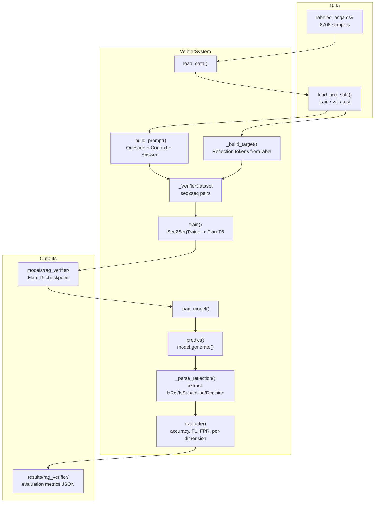

# Answer Verification Experiment Plan (Self-RAG Style)

## Scope

Only two deliverables:

1. **NEW** [`src/configs/rag_verifier.yaml`](src/configs/rag_verifier.yaml) -- configuration for the generative verifier
2. **MODIFY** [`src/rag_system.py`](src/rag_system.py) -- add `VerifierSystem` class alongside existing `RAGSystem`

No changes to `src/filtering/`, `src/training/`, notebooks, or other files.

---

## 1. Concept: Self-RAG-Style Generative Verifier

Like Self-RAG, this system uses a **generative LM** (not a classification head) to evaluate answers. The model is trained to produce structured **reflection tokens** as text output.

**Key difference from existing DeBERTa classifier**: instead of a binary classification head outputting a probability, the verifier *generates* a natural-language judgment with three Self-RAG reflection dimensions plus a final decision.

**Input** (prompt to the LM):

```
Given the following:
Question: {question}
Context: {context}
Answer: {answer}

Evaluate this answer on three dimensions, then give a final decision.
```

**Output** (generated by the LM):

```
[IsRel] relevant [IsSup] fully_supported [IsUse] 5 [Decision] ACCEPT
```

or for a bad answer:

```
[IsRel] relevant [IsSup] no_support [IsUse] 1 [Decision] REJECT
```

### Self-RAG Reflection Tokens

| Token | Values | Meaning |
|-------|--------|---------|
| `[IsRel]` | `relevant` / `irrelevant` | Is the context relevant to the question? |
| `[IsSup]` | `fully_supported` / `partially_supported` / `no_support` | Is the answer supported by the context? |
| `[IsUse]` | `1` to `5` | How useful is the answer for the question? |
| `[Decision]` | `ACCEPT` / `REJECT` | Final binary verdict |

### Deriving Reflection Labels from Existing Data

The `labeled_asqa.csv` dataset has binary labels (1=correct, 0=hallucinated) with gold contexts. We derive the three reflection dimensions:

- **label=1 (correct answer)**: `[IsRel] relevant [IsSup] fully_supported [IsUse] 5 [Decision] ACCEPT`
- **label=0 (hallucinated answer)**: `[IsRel] relevant [IsSup] no_support [IsUse] 1 [Decision] REJECT`

Note: `[IsRel]` is always `relevant` because all samples use gold context by construction. The discriminative signal lives in `[IsSup]` and `[IsUse]`.

---

## 2. File 1: `src/configs/rag_verifier.yaml`

```yaml
# Self-RAG-style answer verifier config.
# Generative LM that produces reflection tokens + ACCEPT/REJECT.
# No retriever, no KB. Gold context fed directly.

model:
  name: "google/flan-t5-base"
  max_input_length: 512
  max_target_length: 64
  model_save_dir: "models/rag_verifier"

data:
  labeled_csv: "data/asqa/labeled_asqa.csv"
  test_ratio: 0.2
  val_ratio: 0.2
  seed: 42
  context_max_chars: 800

training:
  batch_size: 4
  num_epochs: 5
  learning_rate: 5.0e-5
  warmup_ratio: 0.1
  weight_decay: 0.01
  max_grad_norm: 1.0
  gradient_accumulation_steps: 4
  early_stopping_patience: 3
  save_total_limit: 2
  seed: 42
  fp16: false

evaluation:
  results_dir: "results/rag_verifier"

prompt_template: |
  Given the following:
  Question: {question}
  Context: {context}
  Answer: {answer}

  Evaluate this answer on three dimensions, then give a final decision.

reflection_tokens:
  accept_target: "[IsRel] relevant [IsSup] fully_supported [IsUse] 5 [Decision] ACCEPT"
  reject_target: "[IsRel] relevant [IsSup] no_support [IsUse] 1 [Decision] REJECT"
  decision_keyword: "[Decision]"
  accept_keyword: "ACCEPT"
  reject_keyword: "REJECT"
```

Key design decisions:
- **Flan-T5-base** (250M params) -- already available in the project's model cache, proven to work with the existing `GeneratorTrainer`, and small enough to fine-tune on a single GPU. Flan instruction-tuning makes it well-suited for structured evaluation tasks.
- **lr=5e-5** -- standard for Flan-T5 fine-tuning (higher than DeBERTa's 1e-5, which was specific to that model's instability).
- **max_target_length=64** -- the reflection output is short (~15 tokens).
- **Prompt template** and **reflection targets** are config-driven so they can be iterated without code changes.

---

## 3. File 2: `src/rag_system.py` -- Add `VerifierSystem`

The existing `RAGSystem` class (lines 33-297) stays completely untouched. A new `VerifierSystem` class is added below it.

### Class design

```python
class VerifierSystem:
    """
    Self-RAG-style answer verifier -- no retriever, no KB.

    Fine-tunes a seq2seq LM (Flan-T5) to generate reflection tokens
    (IsRel, IsSup, IsUse) plus an ACCEPT/REJECT decision, given
    (question, gold_context, candidate_answer) as input.

    Pipeline: load_data --> train --> load_model --> evaluate --> predict
    """
```

### Internal Dataset Class

A private `_VerifierDataset(torch.utils.data.Dataset)` inside `rag_system.py`:

```python
class _VerifierDataset(Dataset):
    """Seq2seq dataset for Self-RAG-style answer verification."""

    def __init__(self, df, tokenizer, cfg, context_extractor):
        # For each row: build input prompt, build target reflection string
        # Tokenize lazily in __getitem__
```

- `__getitem__` returns `{"input_ids", "attention_mask", "labels"}` (standard HF seq2seq format)
- Input: prompt template filled with (question, extracted top-1 context, answer)
- Target: `accept_target` if label=1, `reject_target` if label=0 (from config)
- Truncation: `only_first` on the input (truncate context, preserve question and answer)

### Methods

**`__init__(self, config_name="rag_verifier")`**
- Loads config via `load_config(config_name)`
- Detects device (cuda/cpu)
- Initializes `tokenizer` and `model` as `None` (lazy)

**`load_data(self, csv_path=None)`**
- Calls `load_and_split()` from `src/filtering/data_split.py`
- Uses config `data.test_ratio`, `data.val_ratio`, `data.seed`
- Stores `self.train_df`, `self.val_df`, `self.test_df`
- Logs split sizes

**`_build_prompt(self, question, context, answer)`**
- Fills `prompt_template` from config with the three inputs
- Returns the formatted input string

**`_build_target(self, label)`**
- Returns `accept_target` if label=1, `reject_target` if label=0
- Both strings come from `config["reflection_tokens"]`

**`_extract_context(self, context_str)`**
- Reuses `_extract_top1_context()` from `learned_filter.py` to parse the stringified context dict into a plain-text passage
- Caps at `config["data"]["context_max_chars"]`

**`train(self, resume_from_checkpoint=False)`**
- Loads tokenizer + model from `config["model"]["name"]` (Flan-T5)
- Builds `_VerifierDataset` for train and val splits
- Uses HuggingFace `Seq2SeqTrainer` + `Seq2SeqTrainingArguments`:
  - `predict_with_generate=True` for validation
  - `metric_for_best_model="eval_loss"` (generative task, no classification AUC)
  - `load_best_model_at_end=True`
  - Early stopping with patience from config
- Saves best checkpoint to `config["model"]["model_save_dir"]`
- Returns the output path

**`load_model(self, model_path=None)`**
- Loads saved Flan-T5 checkpoint from `model_path` or `config["model"]["model_save_dir"]`
- Stores as `self.model` + `self.tokenizer`
- Sets model to eval mode

**`predict(self, question, context, answer)`**
- Builds prompt via `_build_prompt()`
- Tokenizes and generates with `model.generate()`
- Decodes the output
- Parses the generated text for `[Decision] ACCEPT` or `[Decision] REJECT`
- Returns a dict with `{"decision": "ACCEPT"/"REJECT", "is_rel": ..., "is_sup": ..., "is_use": ..., "raw_output": ...}`

**`predict_batch(self, questions, contexts, answers, batch_size=16)`**
- Batch version of `predict()`
- Returns list of prediction dicts

**`evaluate(self, split="test")`**
- Runs `predict_batch()` on the chosen split
- Computes: accuracy, precision, recall, F1, FPR, confusion matrix
- Also computes per-dimension accuracy (IsRel, IsSup, IsUse) by parsing generated tokens
- Saves results to `config["evaluation"]["results_dir"]`
- Returns metrics dict

**`_parse_reflection(self, generated_text)`**
- Parses the generated string to extract individual reflection values
- Looks for `[IsRel]`, `[IsSup]`, `[IsUse]`, `[Decision]` markers
- Returns structured dict; falls back gracefully if parsing fails (counts as REJECT)

### New imports in `rag_system.py`

Only these are added (at the top, alongside existing imports):

```python
import json
import pandas as pd
from torch.utils.data import Dataset
from transformers import (
    AutoModelForSeq2SeqLM,   # already imported
    AutoTokenizer,           # already imported
    Seq2SeqTrainer,
    Seq2SeqTrainingArguments,
    DataCollatorForSeq2Seq,
    EarlyStoppingCallback,
)
from .configs import load_config
from .filtering.data_split import load_and_split
from .filtering.learned_filter import _extract_top1_context
```

Key: `Seq2SeqTrainer` (not regular `Trainer`) is used because this is a generative task, not classification. `AutoModelForSeq2SeqLM` and `AutoTokenizer` are already imported in the file.

---

## 4. Data Flow



---

## 5. Example I/O

**Input prompt** (for a correct answer, label=1):

```
Given the following:
Question: When does the new bunk'd come out?
Context: List of Bunk'd episodes: The second season of Bunk'd premiered on August 23, 2016...
Answer: The new bunk'd episode 41 comes out on April 21, 2017.

Evaluate this answer on three dimensions, then give a final decision.
```

**Target output** (training label):

```
[IsRel] relevant [IsSup] fully_supported [IsUse] 5 [Decision] ACCEPT
```

**Input prompt** (for a hallucinated answer, label=0):

```
Given the following:
Question: When does the new bunk'd come out?
Context: List of Bunk'd episodes: The second season of Bunk'd premiered on August 23, 2016...
Answer: The new bunk'd episode 41 comes out on September 3, 2018.

Evaluate this answer on three dimensions, then give a final decision.
```

**Target output** (training label):

```
[IsRel] relevant [IsSup] no_support [IsUse] 1 [Decision] REJECT
```

---

## 6. Differences from Existing DeBERTa Filter

| Aspect | Existing DeBERTa Filter | New VerifierSystem |
|--------|------------------------|--------------------|
| Model | DeBERTa-v3-base (184M, encoder-only) | Flan-T5-base (250M, seq2seq) |
| Output | Binary probability via classification head | Generated text with reflection tokens |
| Decision | `P(faithful) >= threshold` | Parse `[Decision]` from generated text |
| Dimensions | Single: faithfulness (IsSup) | Three: IsRel + IsSup + IsUse |
| Input format | `(Premise: ctx, Hypothesis: ans)` | Full prompt with question + context + answer |
| Question used | No (discarded) | Yes (part of prompt) |
| Threshold | Requires sweep + min-FPR selection | Not needed (model generates the decision directly) |

---

## 7. What is NOT in Scope

Deferred to a future phase:

- Modifying any existing files in `src/filtering/` or `src/training/`
- Creating experiment notebooks
- Implementing causal LM variants (Llama, Mistral)
- Adding partially_supported / partially_relevant intermediate labels (requires richer annotation)
- Running experiments or generating results
