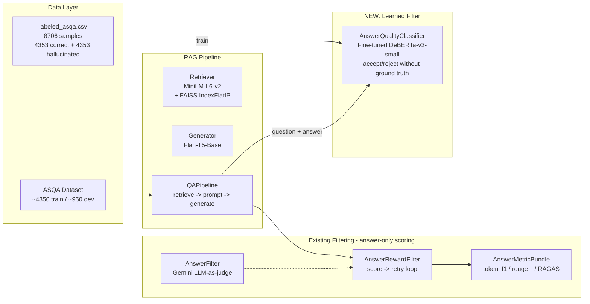
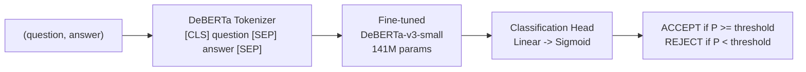

# RAG Filtering Thesis: Full Engineering and Research Plan

---

## 1. Current System Overview

### Architecture (Current + Proposed)



### File Map (What Exists)

**Core RAG Pipeline:**
- [src/rag_system.py](src/rag_system.py) -- Orchestrator: loads models, trains retriever/generator, builds index, answers questions
- [src/config.py](src/config.py) -- `RAGConfig` dataclass with all hyperparameters
- [src/retrieval/qa_pipeline.py](src/retrieval/qa_pipeline.py) -- `QAPipeline`: retrieve top-K via FAISS, build prompt, generate via Flan-T5
- [src/retrieval/indexer.py](src/retrieval/indexer.py) -- `DocumentIndexer`: FAISS IndexFlatIP with save/load
- [src/training/retriever_trainer.py](src/training/retriever_trainer.py) -- Contrastive learning for SentenceTransformer with checkpointing
- [src/training/generator_trainer.py](src/training/generator_trainer.py) -- Seq2seq fine-tuning with checkpointing

**Data:**
- [src/data/asqa_loader.py](src/data/asqa_loader.py) -- `ASQALoader`: loads ASQA CSV (long-form QA with ambiguous questions)
- [src/data/hotpotqa_loader.py](src/data/hotpotqa_loader.py) -- `HotpotQALoader`: loads HotpotQA CSV (multi-hop short-form QA)
- [data/asqa/train.csv](data/asqa/train.csv) -- ~4350 train samples (id, question, answer, context JSON, supporting_facts JSON)
- [data/asqa/dev.csv](data/asqa/dev.csv) -- ~950 dev samples (same format)
- [data/asqa/labeled_asqa.csv](data/asqa/labeled_asqa.csv) -- **8706 labeled samples** (4353 correct label=1, 4353 hallucinated label=0). Columns: id, question, answer, context, supporting_facts, label. Hallucinated IDs end with `b`. Hallucinations are subtle fact modifications (date shifts, entity swaps, number changes).
- [data/asqa/hallu_asqa.csv](data/asqa/hallu_asqa.csv) -- 4353 hallucinated-only samples (same as label=0 rows in labeled_asqa.csv, without label column)

**Filtering (already built):**
- [src/filtering/llm_filter.py](src/filtering/llm_filter.py) -- `AnswerFilter`: Gemini API scores answer vs ground truth on correctness/similarity/completeness (0-10), emits GOOD/BAD
- [src/filtering/metrics.py](src/filtering/metrics.py) -- `AnswerMetricBundle`: computes token_f1, rouge_l, optionally RAGAS answer_correctness/answer_similarity, BERTScore
- [src/filtering/reward_filter.py](src/filtering/reward_filter.py) -- `AnswerRewardComputer` (weighted composite) + `AnswerRewardFilter` (generate-score-retry loop)
- [src/filtering/weight_fitting.py](src/filtering/weight_fitting.py) -- `WeightBank` (per-dataset weights) + `WeightFitter` (correlation/NNLS fitting from calibration data)
- [src/filtering/data_models.py](src/filtering/data_models.py) -- `AnswerReward`, `FilterDiagnostics`, `ANSWER_WEIGHT_PRIORS`

**Evaluation:**
- [src/evaluation/ragas_evaluator.py](src/evaluation/ragas_evaluator.py) -- `RAGASEvaluator`: wraps RAGAS metrics, supports system comparison
- [src/evaluation/retriever_evaluator.py](src/evaluation/retriever_evaluator.py) -- Recall@K, Precision@K, MRR for retriever

**Results:**
- [results/asqa_normal_rag_predictions.csv](results/asqa_normal_rag_predictions.csv) -- ~950 predictions with columns: id, question, gold_answer, predicted_answer, contexts, num_contexts

**Notebooks (7):**
- [notebooks/rag-asqa-baseline.ipynb](notebooks/rag-asqa-baseline.ipynb) -- Main experiment notebook for ASQA baseline RAG
- [notebooks/synthetic_data_generation.ipynb](notebooks/synthetic_data_generation.ipynb), [notebooks/asqa_data_preparation.ipynb](notebooks/asqa_data_preparation.ipynb), [notebooks/data_collection.ipynb](notebooks/data_collection.ipynb), [notebooks/evaluation_analysis.ipynb](notebooks/evaluation_analysis.ipynb), [notebooks/verbalization.ipynb](notebooks/verbalization.ipynb)

### Step-by-step: How the Current System Works

1. **Data Loading**: `ASQALoader` reads CSV files where each row has a question, a long-form gold answer, context (JSON with titles + sentences), and supporting facts.
2. **Retrieval**: `DocumentIndexer` encodes all passages with MiniLM-L6-v2 into FAISS. At query time, the question is encoded and top-K passages are retrieved via inner product similarity.
3. **Generation**: Retrieved passages are formatted into a prompt (`"Use the context to answer.\nContext:\n{passages}\nQuestion: {q}\nAnswer:"`) and fed to Flan-T5-Base which generates a response.
4. **Current Filtering**: After generation, `AnswerRewardFilter` scores the generated answer against the ground truth using `AnswerMetricBundle` (token_f1, rouge_l, RAGAS metrics). If the composite score is below a threshold (default 0.50), it regenerates up to 3 times and keeps the best-scoring attempt.

---

## 2. Gap Analysis

### CRITICAL GAPS (must fix for thesis)

- **Ground truth at inference**: ALL filtering metrics compare answer to ground truth. `AnswerRewardFilter.answer()` takes `ground_truth` as a required parameter. **Required**: A real filter must work WITHOUT ground truth at inference time. The trained classifier learns patterns from labeled data and predicts accept/reject using only (question, answer).
- **No inference-time filter**: Current filter is a scoring/retry tool during evaluation. No true accept/reject gate. **Required**: A standalone `AnswerQualityClassifier` that receives (question, answer) and returns accept/reject + confidence without ground truth.
- **No learned filter**: No classifier model. Only heuristic weights. **Required**: A fine-tuned DeBERTa-v3-small trained on `labeled_asqa.csv` that learns accept/reject from 8,706 labeled samples.
- **No bad-answer generation**: No mechanism to synthesize incorrect answers for training data. **Status: SOLVED** by `labeled_asqa.csv` which already contains 4,353 hallucinated samples with subtle fact modifications (date shifts, entity swaps, number changes).
- **No filtering evaluation metrics**: Only composite reward scores. No filter precision/recall/F1. **Required**: `FilterEvaluator` with proper precision, recall, F1, accuracy, rejection rate metrics.
- **No comparison framework**: No structured way to compare filter vs. no-filter on the same data. **Required**: Evaluation harness that compares No Filter baseline vs. Learned Filter on the same held-out test set.

**Note**: Context evaluation (grey-box approach) is intentionally excluded. The filtering layer retains the existing black-box answer-only approach. The classifier operates on (question, answer) pairs only.

### WHAT IS USABLE AS-IS

- RAG pipeline is complete and produces predictions (950 samples already in `results/asqa_normal_rag_predictions.csv`)
- `labeled_asqa.csv` provides 8,706 balanced labeled samples -- no synthetic data generation needed
- `AnswerMetricBundle` provides signals (token_f1, rouge_l) useful for metric-separation analysis
- `AnswerFilter` (LLM-as-judge) useful for supplementary labeling if needed
- ASQA dataset is ideal: long-form answers, ambiguous questions, already loaded
- Existing `WeightBank` / `WeightFitter` remain useful for composite-score calibration

### WHAT IS IRRELEVANT TO THESIS

- HotpotQA loader and data (short-form, not the focus)
- Retriever training logic (the thesis is about filtering, not improving retrieval)
- Generator training logic (same -- treat the RAG system as a black box that produces answers)
- [notebooks/rag.py](notebooks/rag.py) -- legacy monolithic file, already superseded by `src/`
- [notebooks/rag_example.py](notebooks/rag_example.py) -- demo script with a syntax error (line 145)

---

## 3. Filtering Layer Design: Learned Answer Quality Classifier

### Overview

A single unified filtering layer: a **fine-tuned DeBERTa-v3-small** binary classifier that takes (question, answer) as input and outputs accept/reject. It learns to detect hallucinated answers from the labeled training data without requiring ground truth or context at inference time.

### Why This Design

The hallucinations in `labeled_asqa.csv` are **subtle fact modifications** that preserve grammar and text structure perfectly:
- Date shifts: "April 21, 2017" -> "April 21, 2018" (`asqa_0b`)
- Entity swaps: "Alabama Crimson Tide won" -> "Clemson Tigers won" (`asqa_1b`)
- Number changes: episode 133 -> 134 (`asqa_7b`), record of 9 -> 10 (`asqa_6b`)
- Name substitutions: "Bloomsbury" -> "Penguin Books" (`asqa_8b`)

Simple text statistics (length, word overlap) cannot distinguish these. The filter needs a model with deep semantic understanding trained on labeled examples. DeBERTa-v3-small (141M params) provides disentangled attention that captures fine-grained token interactions between question and answer, while being small enough for inference-time use.

### Architecture



### Input/Output Specification

```
Input:  "[CLS] When does the new bunk'd come out? [SEP] The new bunk'd episode 41
         comes out on April 21, 2018... [SEP]"
Output: P(correct) = 0.23  -->  REJECT (threshold = 0.5)
```

The model receives the question-answer pair as a single sequence. The `[CLS]` token representation is passed through a linear classification head with sigmoid activation, producing a probability that the answer is correct.

### Training Configuration

- **Model**: `microsoft/deberta-v3-small` (141M params)
- **Task**: Binary classification (label=1 correct, label=0 hallucinated)
- **Input format**: `tokenizer(question, answer, truncation=True, max_length=512)`
- **Learning rate**: 2e-5
- **Epochs**: 3 (with early stopping on validation F1)
- **Batch size**: 16 (adjust for GPU memory)
- **Warmup**: 10% of training steps
- **Weight decay**: 0.01
- **Metric for best model**: F1 on validation set

### Inference Class

New file `src/filtering/learned_filter.py`:

```python
class AnswerQualityClassifier:
    """Learned answer-only filter. No ground truth or context needed at inference."""

    def __init__(self, model_path: str, threshold: float = 0.5):
        self.tokenizer = AutoTokenizer.from_pretrained(model_path)
        self.model = AutoModelForSequenceClassification.from_pretrained(model_path)
        self.threshold = threshold

    def predict(self, question: str, answer: str) -> FilterDecision:
        inputs = self.tokenizer(question, answer, return_tensors="pt",
                                truncation=True, max_length=512)
        logits = self.model(**inputs).logits
        prob_correct = torch.softmax(logits, dim=-1)[0, 1].item()
        return FilterDecision(
            accept=prob_correct >= self.threshold,
            confidence=prob_correct,
            reasoning=f"P(correct)={prob_correct:.3f}, threshold={self.threshold}",
        )

    def predict_batch(self, questions: list[str], answers: list[str]) -> list[FilterDecision]:
        ...
```

### How Each Gap Is Addressed

- **Ground truth at inference** -> The trained model needs only (question, answer). No ground truth.
- **No inference-time filter** -> `predict()` returns accept/reject with confidence.
- **No learned filter** -> Fine-tuned DeBERTa, trained on 8,706 labeled samples.
- **No bad-answer data** -> `labeled_asqa.csv` already provides 4,353 hallucinated samples.
- **No filtering metrics** -> `FilterEvaluator` computes precision, recall, F1, accuracy.
- **No comparison** -> No-filter baseline vs. learned filter on held-out test set.

---

## 4. Data Pipeline

### Source: `labeled_asqa.csv` (No Synthetic Generation Needed)

The dataset is already built: [data/asqa/labeled_asqa.csv](data/asqa/labeled_asqa.csv) contains 8,706 labeled samples.

- **4,353 correct answers** (label=1): IDs like `asqa_0`, `asqa_1`, ... Answers match the context.
- **4,353 hallucinated answers** (label=0): IDs like `asqa_0b`, `asqa_1b`, ... Subtle factual modifications of the correct answers.
- **Columns**: id, question, answer, context, supporting_facts, label
- **Balanced**: Exactly 50/50 split between correct and hallucinated.

### Split Strategy

Split by **base question ID** to prevent data leakage (the correct version `asqa_X` and its hallucinated counterpart `asqa_Xb` must always be in the same split):

```python
import pandas as pd
from sklearn.model_selection import train_test_split

def load_and_split(csv_path: str, test_ratio=0.2, val_ratio=0.2, seed=42):
    df = pd.read_csv(csv_path)
    base_ids = df["id"].str.replace(r"b$", "", regex=True).unique()  # 4,353 unique questions

    train_ids, test_ids = train_test_split(base_ids, test_size=test_ratio, random_state=seed)
    train_ids, val_ids = train_test_split(train_ids, test_size=val_ratio, random_state=seed)

    def mask(ids):
        return df["id"].str.replace(r"b$", "", regex=True).isin(ids)

    return df[mask(train_ids)], df[mask(val_ids)], df[mask(test_ids)]
```

**Resulting splits** (approximate):
- **Train**: ~2,786 questions x 2 = ~5,572 samples -- for model training
- **Validation**: ~696 questions x 2 = ~1,392 samples -- for early stopping and threshold tuning
- **Test**: ~871 questions x 2 = ~1,742 samples -- held out, final evaluation only

**Where to add**: New file `src/filtering/data_split.py`

### Additional Data: Real RAG Predictions

[results/asqa_normal_rag_predictions.csv](results/asqa_normal_rag_predictions.csv) contains ~950 real RAG-generated predictions. These are used for:
- Applying the trained filter to real (non-synthetic) outputs in Week 4
- Qualitative analysis of what the filter accepts/rejects on actual system outputs

---

## 5. Evaluation Framework

### Definitions

The filter's job is to ACCEPT correct answers and REJECT hallucinated ones:

- **TP** (True Positive): Correct answer (label=1) accepted by filter
- **TN** (True Negative): Hallucinated answer (label=0) rejected by filter
- **FP** (False Positive): Hallucinated answer (label=0) incorrectly accepted -- the dangerous case
- **FN** (False Negative): Correct answer (label=1) incorrectly rejected

### Metrics

- **Precision** = TP / (TP + FP) -- "Of accepted answers, what fraction are actually correct?"
- **Recall** = TP / (TP + FN) -- "Of all correct answers, what fraction did I accept?"
- **Rejection Precision** = TN / (TN + FN) -- "Of rejected answers, what fraction are actually bad?"
- **Rejection Recall** = TN / (TN + FP) -- "Of all bad answers, what fraction did I catch?"
- **Overall Accuracy** = (TP + TN) / N
- **F1** = 2 * Precision * Recall / (Precision + Recall)
- **Rejection Rate** = (TN + FN) / N -- "What fraction of all answers are filtered out?"

### Implementation

New file `src/filtering/filter_evaluator.py`:

```python
@dataclass
class FilterResult:
    precision: float
    recall: float
    f1: float
    accuracy: float
    rejection_precision: float
    rejection_recall: float
    rejection_rate: float
    tp: int; tn: int; fp: int; fn: int

class FilterEvaluator:
    def evaluate(self, predictions: list[bool], labels: list[int]) -> FilterResult:
        tp = sum(p and l == 1 for p, l in zip(predictions, labels))
        tn = sum(not p and l == 0 for p, l in zip(predictions, labels))
        fp = sum(p and l == 0 for p, l in zip(predictions, labels))
        fn = sum(not p and l == 1 for p, l in zip(predictions, labels))
        ...
```

### Comparison Table

Run on the held-out test set (~1,742 samples):

- No Filter (accept all): Precision = 50.0%, Recall = 100%, F1 = 66.7%, Accuracy = 50.0%, Rejection Rate = 0%
- Learned Filter (ours): measured from the trained model

The no-filter baseline accepts everything, so precision equals the label=1 ratio (50% for balanced data), recall is 100% (all correct answers are accepted), and accuracy is 50%.

### Additional Analysis

- **Precision-Recall curve**: Sweep threshold from 0 to 1, plot precision vs. recall
- **Error analysis**: Categorize hallucination types the filter catches vs. misses (date shifts, entity swaps, number changes, name substitutions)
- **Confidence calibration**: How well does the model's predicted probability match actual correctness?

---

## 6. Step-by-Step Execution Roadmap

### Week 0: Codebase Cleanup (per project-structure rule)

Remove files and folders that are irrelevant to the thesis, aligning the repo with the `project-structure.mdc` rule.

**Files to DELETE:**
- `notebooks/rag.py` -- legacy monolithic RAG script, superseded by `/src/`
- `notebooks/rag_example.py` -- demo script with syntax error
- `notebooks/rag-hotpotqa.ipynb` -- HotpotQA notebook, not the thesis focus
- `src/data/hotpotqa_loader.py` -- HotpotQA loader, not needed
- `src/filtering/ragas_reward_filter.py` -- backward-compat shim, no external imports depend on it
- `cursorRuleUsage.md` -- outdated documentation about old rules
- `commit_and_test_filtering_35c97c42.plan.md` -- old plan, superseded by this plan

**Folders to DELETE:**
- `notebooks/experiments/` -- empty (only .gitkeep)
- `notebooks/exploration/` -- empty (only .gitkeep)
- `notebooks/visualization/` -- empty (only .gitkeep)
- `notebooks/rag_output/` -- stale index files from old notebook runs
- `notebooks/rag_output_asqa/` -- stale checkpoints/index from old notebook runs
- `rag_output/` (top-level) -- stale output directory
- `evaluation/` (top-level) -- empty dir (evaluation code lives in `/src/evaluation/`)
- `experiments/` (top-level) -- empty dir (only .gitkeep)
- `data/hotpot_qa/` -- HotpotQA dataset files, not needed
- `data/hotpot_dev_distractor_v1.json` -- HotpotQA dev data

**Files to UPDATE (fix broken imports after deletion):**
- `src/data/__init__.py` -- remove `HotpotQALoader` import and export
- `src/data/loader.py` -- remove `HotpotQALoader` import and export

**Files to KEEP (part of working RAG system):**
- `train.py` -- main CLI training script
- `src/training/` -- retriever/generator training (RAG system dependency)
- `src/rag_system.py` -- orchestrator (references HotpotQA but only conditionally)
- `tests/` -- empty but reserved for future unit tests per evaluation rule

### Week 1: Data Foundation and Evaluation Harness

**Rules enforced**: `project-structure.mdc` (files in correct locations), `filtering-design.mdc` (split by base question ID, `FilterDecision` dataclass), `evaluation-standards.mdc` (all 6 metrics, no-filter baseline), `config-and-reproducibility.mdc` (seed=42), `python-standards.mdc` (type hints, dataclasses, structured logging).

1. **Create `src/filtering/data_split.py`** -- implement `load_and_split()` to split `labeled_asqa.csv` into train/val/test by base question ID. Seed=42 per config rule.
2. **Create `src/filtering/filter_evaluator.py`** -- implement `FilterResult` dataclass and `FilterEvaluator` class. Must compute all 6 metrics per evaluation-standards rule.
3. **Add `FilterDecision` dataclass** to [src/filtering/data_models.py](src/filtering/data_models.py) with fields: `accept: bool`, `confidence: float`, `reasoning: str`.
4. **Compute no-filter baseline** on test set: precision=50%, recall=100%, F1=66.7%, accuracy=50%. Save to `/results/` as JSON per evaluation rule.
5. **Sanity check**: run `AnswerMetricBundle` on 50 correct vs 50 hallucinated samples from train set -- verify that lexical metrics (token_f1, rouge_l) show score separation between the two groups.

**Deliverable**: Working data pipeline + evaluation harness + baseline numbers saved to `/results/`.

### Week 2: Model Training

**Rules enforced**: `filtering-design.mdc` (AnswerQualityClassifier interface, train on labeled_asqa.csv, monitor val F1, save to `models/`), `config-and-reproducibility.mdc` (all hyperparams from `filtering.yaml`, log training args to JSON), `python-standards.mdc` (type hints, max 500 lines/file).

1. **Create `src/filtering/learned_filter.py`** with:
   - `AnswerQualityClassifier` class (inference): `predict(question, answer) -> FilterDecision`
   - `train_classifier()` function (training loop using HuggingFace Trainer)
   - All hyperparameters loaded from `src/configs/filtering.yaml` `learned_filter` section
2. **Fine-tune DeBERTa-v3-small** on train split (~5,572 samples):
   - Input: `tokenizer(question, answer, max_length=512)`
   - Output: binary classification (num_labels=2)
   - Monitor validation F1 after each epoch, save best checkpoint
3. **Save model** to `models/answer_filter/`. Log training args + per-epoch metrics to `results/training_log.json`.

**Deliverable**: Trained model checkpoint + training log JSON.

### Week 3: Evaluation, Threshold Tuning, and Error Analysis

**Rules enforced**: `evaluation-standards.mdc` (all 6 metrics, compare vs no-filter baseline, never evaluate on train, report threshold, include error analysis), `config-and-reproducibility.mdc` (save results to `/results/` with config snapshot).

1. **Threshold tuning**: Run model on validation set, compute precision-recall curve, find optimal threshold that maximizes F1. Update `filtering.yaml` `learned_filter.threshold`.
2. **Final evaluation**: Run model on held-out test set (~1,742 samples), compute all 6 metrics per evaluation rule.
3. **Produce comparison table**: No Filter vs. Learned Filter. Save to `results/filter_comparison.json`.
4. **Error analysis** (required by evaluation rule):
   - Which hallucination types are caught? (date shifts, entity swaps, number changes, name subs)
   - Which are missed? Inspect false positives and false negatives
   - Plot confusion matrix and confidence distribution
5. **Save per-sample predictions** to `results/test_predictions.csv` (id, question, answer, label, predicted, confidence).

**Deliverable**: Comparison table, precision-recall curve, error analysis report -- all in `/results/`.

### Week 4: Integration, Real-World Application, and Thesis Writing

**Rules enforced**: `project-structure.mdc` (filter integration in QAPipeline), `notebook-rules.mdc` (notebook imports from `/src/`, has Title/Objective/Results structure), `config-and-reproducibility.mdc` (save ablation results with config snapshots).

1. **Integrate into pipeline**: Add `filtered_answer()` method to [src/retrieval/qa_pipeline.py](src/retrieval/qa_pipeline.py). Filter loads config from `filtering.yaml`.
2. **Apply to real RAG outputs**: Run the trained filter on `results/asqa_normal_rag_predictions.csv` (~950 predictions). Report how many are accepted/rejected. Save to `results/rag_predictions_filtered.csv`.
3. **Ablation studies** (save each to `/results/` with config):
   - Training data size: train on 25%, 50%, 75%, 100% of data -- plot accuracy curve
   - Threshold sensitivity: sweep threshold from 0.1 to 0.9
   - Max sequence length: 256 vs 384 vs 512
4. **Create `notebooks/filter_training.ipynb`** per notebook rules: imports from `/src/`, structured sections, seeds fixed.
5. **Update `src/filtering/__init__.py`** with new exports
6. **Update `src/configs/filtering.yaml`** with learned filter config
7. **Write thesis**: Methodology, Experiments, Results, Discussion chapters

**Deliverable**: End-to-end integrated pipeline, ablation tables, thesis draft.

---

## 7. Cursor Rules Applied

All implementation must follow the 6 rules defined in `.cursor/rules/`. Here is how each rule maps to this plan:

| Rule File | Applies To | Key Constraint |
|-----------|-----------|----------------|
| `project-structure.mdc` | All code | Pipeline flow: `retrieve -> generate -> filter -> accept/reject`. Filtering logic ONLY in `/src/filtering/`. Checkpoints in `/models/`. Results in `/results/`. |
| `python-standards.mdc` | All `.py` files | Type hints everywhere. `@dataclass` for data containers. Structured logging. Max 500 lines/file, 100 lines/function. |
| `config-and-reproducibility.mdc` | Configs, training | No hardcoded thresholds -- all from `filtering.yaml`. Seed=42 everywhere. Log training args + metrics to JSON. |
| `filtering-design.mdc` | `/src/filtering/` | `AnswerQualityClassifier.predict(question, answer) -> FilterDecision`. Train on `labeled_asqa.csv`. Split by base question ID. Monitor val F1. |
| `evaluation-standards.mdc` | Evaluation | Report all 6 metrics (Precision, Recall, F1, Accuracy, Rejection Recall, Rejection Rate). Always compare vs No Filter baseline. Never evaluate on train data. |
| `notebook-rules.mdc` | Notebooks | Notebooks import from `/src/`, never define core logic. Each has Title + Objective + Sections + Results. |

---

## 8. Code Changes Summary (per project-structure and filtering-design rules)

### New Files to Create

```
src/filtering/
├── data_split.py            # NEW: load_and_split() for labeled_asqa.csv
├── learned_filter.py        # NEW: AnswerQualityClassifier + train_classifier()
├── filter_evaluator.py      # NEW: FilterEvaluator + FilterResult
```

- **`src/filtering/data_split.py`** -- `load_and_split(csv_path, test_ratio, val_ratio, seed)` returns (train_df, val_df, test_df)
- **`src/filtering/learned_filter.py`** -- `AnswerQualityClassifier` (loads model, runs inference) + `train_classifier(train_df, val_df, model_name, output_dir, training_args)` (fine-tuning loop)
- **`src/filtering/filter_evaluator.py`** -- `FilterResult` dataclass + `FilterEvaluator.evaluate(predictions, labels)`

### Files to Modify

- **[src/filtering/data_models.py](src/filtering/data_models.py)** -- Add `FilterDecision` dataclass:

```python
@dataclass
class FilterDecision:
    accept: bool
    confidence: float
    reasoning: str
```

- **[src/filtering/__init__.py](src/filtering/__init__.py)** -- Add exports for `AnswerQualityClassifier`, `FilterEvaluator`, `FilterResult`, `FilterDecision`

- **[src/configs/filtering.yaml](src/configs/filtering.yaml)** -- Add learned filter config section:

```yaml
learned_filter:
  model_name: "microsoft/deberta-v3-small"
  model_path: "models/answer_filter"
  threshold: 0.5
  max_length: 512
  batch_size: 16
  num_epochs: 3
  learning_rate: 2e-5
```

- **[src/retrieval/qa_pipeline.py](src/retrieval/qa_pipeline.py)** -- Add `filtered_answer()` integration method:

```python
def filtered_answer(self, question, top_k=None, filter_gate=None):
    answer, contexts = self.answer(question, top_k, return_contexts=True)
    if filter_gate:
        decision = filter_gate.predict(question, answer)
        return answer, contexts, decision
    return answer, contexts, None
```

### Files Kept As-Is (Still Useful)

- [src/filtering/metrics.py](src/filtering/metrics.py) -- `AnswerMetricBundle` for sanity-check metric separation analysis
- [src/filtering/llm_filter.py](src/filtering/llm_filter.py) -- `AnswerFilter` for supplementary LLM-as-judge labeling if needed
- [src/filtering/reward_filter.py](src/filtering/reward_filter.py) -- Existing retry logic, not modified
- [src/filtering/weight_fitting.py](src/filtering/weight_fitting.py) -- `WeightBank`/`WeightFitter` for composite score experiments

### Notebook to Create

- **`notebooks/filter_training.ipynb`** -- Main experiment notebook: data loading, training, evaluation, comparison table, error analysis, ablation plots

---

## 9. Stretch Ideas

- **Alternative model sizes**: Compare DeBERTa-v3-small (141M) vs DeBERTa-v3-xsmall (70M) vs DistilBERT (66M). Trade-off between accuracy and inference speed.
- **Uncertainty estimation**: Capture token-level log probabilities from Flan-T5 generation. Low average log-prob = uncertain = more likely hallucinated. Combine with classifier as an additional feature.
- **Self-consistency checks**: Generate 3-5 answers with temperature > 0. If they disagree semantically, the answer is unreliable. Use agreement score as a secondary signal.
- **Abstention**: Instead of binary accept/reject, allow the filter to output "uncertain" for borderline cases (e.g., confidence between 0.4-0.6) and flag for human review.
- **Per-question difficulty calibration**: Adjust the accept/reject threshold based on question type or difficulty. Harder questions might warrant a lower acceptance threshold.
- **Transfer to real RAG failures**: The model is trained on synthetic hallucinations. Test whether it generalizes to real RAG failure modes (wrong context retrieval, truncated answers, off-topic responses) by evaluating on `asqa_normal_rag_predictions.csv`.
