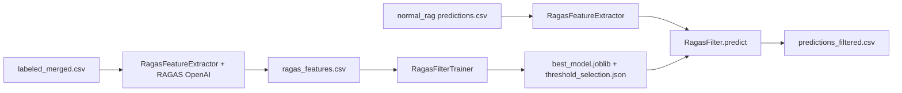

# RAGAS Filter Pipeline — Run Guide

Branch: `final-filtering-pipeline`

This guide explains how to run the full pipeline end to end:

```
labeled corpus → RAGAS features → train sklearn filter → apply to RAG predictions
```

## Pipeline overview



| Stage | Script | Input | Output |
|-------|--------|-------|--------|
| 1 | `scripts/build_ragas_features.py` | `data/merged/labeled_merged.csv` | `results/ragas_filter/ragas_features.csv` |
| 2 | `scripts/train_ragas_filter.py` | feature CSV | `models/ragas_filter/*.joblib`, `threshold_selection.json` |
| 3 | `scripts/run_ragas_filter_on_rag.py` | `results/normal_rag/merged/predictions.csv` | `results/ragas_filter/predictions_filtered.csv` |

Config file: [`configs/experiments/ragas_filter.yaml`](../configs/experiments/ragas_filter.yaml)

Demo notebook: [`notebooks/09_ragas_filter_pipeline_demo.ipynb`](../notebooks/09_ragas_filter_pipeline_demo.ipynb)

---

## Prerequisites

1. **Python 3.10+** with a virtual environment
2. **OpenAI API key** — RAGAS feature extraction uses `gpt-4o-mini` and `text-embedding-3-small`
3. **Labeled data** — `data/merged/labeled_merged.csv` (included in repo)
4. **RAG predictions** (Stage 3) — either run normal RAG first, or use the demo notebook’s stand-in file

---

## 1. Environment setup

From the repository root:

```powershell
# Create venv (skip if you already have one)
python -m venv venv

# Activate (Windows PowerShell)
.\venv\Scripts\Activate.ps1

# Install dependencies
pip install -r requirements.txt
```

Optional — register the venv as a Jupyter kernel:

```powershell
pip install ipykernel
python -m ipykernel install --user --name=ragas-evaluation --display-name "Python (ragas-evaluation)"
```

---

## 2. OpenAI API key

Create a `.env` file in the repo root:

```env
OPENAI_API_KEY=sk-your-key-here
```

Scripts and the demo notebook load this via `python-dotenv`.

**Cost control:** RAGAS calls OpenAI per sample. Always start with a small limit (`--limit 20` or `DEMO_LIMIT = 20` in the notebook) before a full run.

---

## 3. Run via notebook (recommended for first demo)

1. Open [`notebooks/09_ragas_filter_pipeline_demo.ipynb`](../notebooks/09_ragas_filter_pipeline_demo.ipynb)
2. Select kernel **Python (ragas-evaluation)** (or your activated venv)
3. Run cells top to bottom
4. Keep `DEMO_LIMIT = 20` in the setup cell for a cheap first run; set to `None` for a full run

| Notebook section | What it does |
|------------------|--------------|
| 0. Setup | Paths, imports, load config, check API key |
| 1. RAG predictions | Use existing file or create a small demo predictions CSV |
| 2. Stage 1 | Extract RAGAS features from labeled corpus |
| 3. Stage 2 | Train sklearn filter + select min-FPR threshold |
| 4. Stage 3 | Apply filter to RAG predictions |
| 5–6. Results | Output paths + CLI alternative |

---

## 4. Run via CLI (headless)

### Full pipeline (one command)

```powershell
python scripts/run_ragas_pipeline.py --train-limit 20 --apply-limit 20
```

Flags:

- `--train-limit N` — cap labeled rows for Stage 1 (OpenAI cost control)
- `--apply-limit N` — cap RAG rows for Stage 3
- `--skip-features` — reuse existing `ragas_features.csv` and skip Stage 1

### Stage by stage

```powershell
# Stage 1: RAGAS features from labeled corpus (OpenAI)
python scripts/build_ragas_features.py --limit 20

# Stage 2: train filter + save threshold
python scripts/train_ragas_filter.py

# Stage 3: filter RAG predictions (OpenAI for RAG-output features)
python scripts/run_ragas_filter_on_rag.py --limit 20
```

**Production run:** omit `--train-limit` / `--apply-limit` and set `max_samples` / `DEMO_LIMIT` to `None`.

---

## 5. (Optional) Generate real normal-RAG predictions

Stage 3 expects `results/normal_rag/merged/predictions.csv`. To produce it with the real generator (GPU + HuggingFace model download):

```powershell
python experiments/normal_rag_inference/run_inference.py `
  --config configs/experiments/normal_rag_merged.yaml `
  --limit 20
```

Without this step, the demo notebook creates a small stand-in predictions file from the labeled corpus so you can still test Stage 3.

---

## 6. Outputs

| Artifact | Path | Description |
|----------|------|-------------|
| Training features | `results/ragas_filter/ragas_features.csv` | RAGAS metrics + `label` per labeled row |
| Feature checkpoint | `results/ragas_filter/ragas_checkpoint.csv` | Resumable Stage 1 progress |
| Trained model | `models/ragas_filter/<best_model>.joblib` | Best sklearn classifier + feature column list |
| Training reports | `models/ragas_filter/training_results.csv` | Model comparison on held-out split |
| Threshold | `results/ragas_filter/threshold_selection.json` | Min-FPR threshold (recall ≥ 0.70) |
| RAG feature checkpoint | `results/ragas_filter/rag_ragas_checkpoint.csv` | Resumable Stage 3 feature extraction |
| Filtered predictions | `results/ragas_filter/predictions_filtered.csv` | RAG output + `filter_label`, `filter_confidence` |

### Filter columns

- `filter_label`: `1` = accepted (faithful), `0` = rejected
- `filter_confidence`: model probability of the accepted class

---

## 7. Verify installation (no OpenAI calls)

```powershell
python -m pytest tests/test_ragas_filter.py -v
```

All tests should pass without calling OpenAI.

Full test suite:

```powershell
python -m pytest tests/ -q
```

---

## 8. Important notes

### OpenAI usage

Stages **1** and **3** both call OpenAI (RAGAS metric computation). Budget accordingly.

Checkpoint files (`*_checkpoint.csv`) let you resume interrupted runs — re-run the same script and it continues from the last saved batch.

### Label semantics

- **Training (Stage 1–2):** uses aligned `(context, answer, label)` from `labeled_merged.csv`
- **Application (Stage 3):** inference-only on generated `predicted_answer`; corpus `label` is dropped because it describes the original corpus answer, not the RAG output

### RAGAS version compatibility

This repo targets `ragas>=0.1.0`. In **ragas 0.4+**, `context_relevancy` was removed; the config uses six metrics instead. If a metric is unavailable in your install, the wrapper skips it and logs a message.

### Threshold selection

The final accept/reject threshold is chosen on the validation split using **minimize FPR subject to recall ≥ 0.70** (`select_threshold_min_fpr`), not argmax at 0.5.

---

## 9. Project layout (relevant files)

```
configs/experiments/ragas_filter.yaml   # Pipeline config
scripts/
  build_ragas_features.py               # Stage 1
  train_ragas_filter.py                 # Stage 2
  run_ragas_filter_on_rag.py            # Stage 3
  run_ragas_pipeline.py                 # Orchestrator
src/rag_filtering/
  filtering/
    ragas_feature_extractor.py
    ragas_filter_trainer.py
    ragas_filter.py
    helper.py
  evaluation/
    ragas_wrapper.py                    # OpenAI RAGAS backend
experiments/normal_rag_inference/       # Normal RAG (retrieve + generate)
notebooks/09_ragas_filter_pipeline_demo.ipynb
```

---

## 10. Troubleshooting

| Problem | Fix |
|---------|-----|
| `OPENAI_API_KEY is missing` | Add key to repo-root `.env` |
| `No .joblib model found` | Run Stage 2 (`train_ragas_filter.py`) first |
| `predictions.csv` not found | Run normal RAG inference or use the demo notebook’s stand-in cell |
| RAGAS import warnings | Expected on ragas 0.4+; pipeline still works with legacy metric imports |
| Run interrupted mid-batch | Re-run the same script; checkpoint CSV resumes automatically |
| High API cost | Lower `--limit` / `DEMO_LIMIT`; increase `ragas.batch_size` only after a successful small run |
