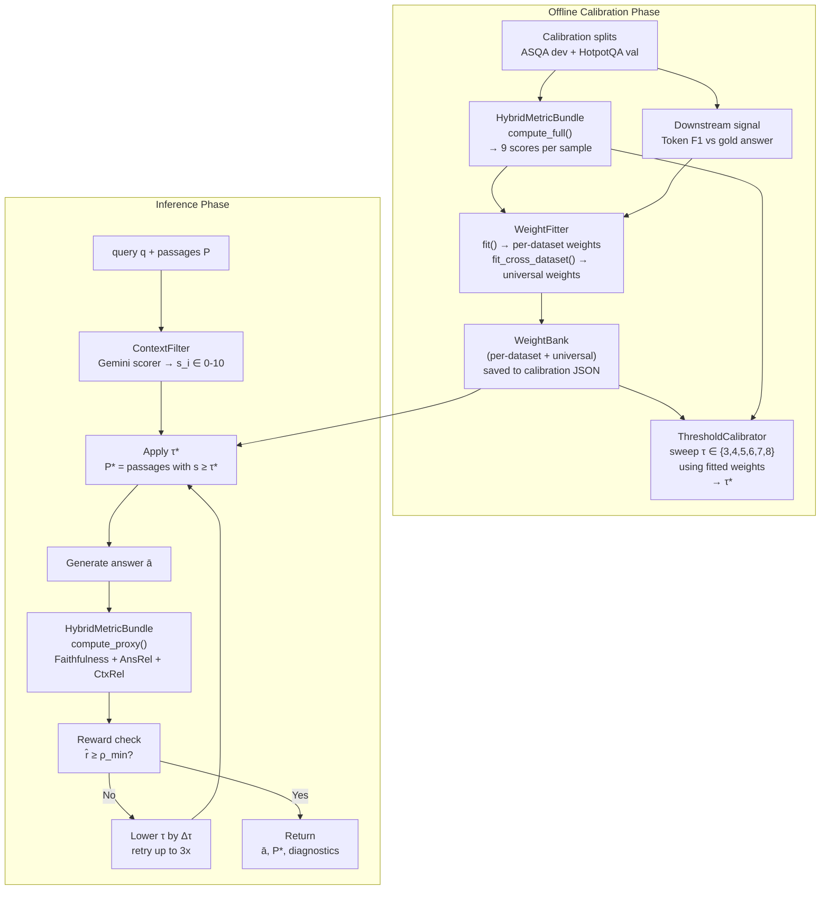

# Hybrid RAGAS-Reward-Guided Filtering (H-RRGF) Pipeline

## The core problem

The current pipeline has two hardcoded decisions that hurt generalisation:

1. **Only 4 RAGAS metrics** — ignores lexical and semantic signals already available
2. **Fixed weights (0.35, 0.30, 0.20, 0.15)** — copied from a paper, not fitted to this data, and will be wrong for other datasets (HotpotQA needs high recall weight; factoid QA needs high faithfulness weight)

The fix is a three-layer hybrid: **multi-metric collection → data-driven weight fitting → dataset-adaptive weight selection**.

---

## Papers referenced


| Paper                                                 | Contribution used                                                                                   |
| ----------------------------------------------------- | --------------------------------------------------------------------------------------------------- |
| **RAGAS** (Es et al., 2023 — arXiv:2309.15217)        | Core 4+3 metrics; Table 3 used as weight *prior*, not ground truth                                  |
| **CRAG** (Yan et al., 2024 — arXiv:2401.15884)        | Corrective retry loop; USE/REFINE/DISCARD → generalised to continuous reward                        |
| **Self-RAG** (Asai et al., 2023 — arXiv:2310.11511)   | Inline per-segment quality critique — mirrored without fine-tuning                                  |
| **BERTScore** (Zhang et al., 2020 — arXiv:1904.09675) | Reference-based semantic metric that bridges lexical and LLM-based signals                          |
| **ROUGE** (Lin, 2004)                                 | Lexical overlap baseline — fast, free, strong correlation with human judgement on long-form answers |


---

## Metric set (hybrid)


| Metric             | Type             | Needs GT | Cost       | Dataset signal      |
| ------------------ | ---------------- | -------- | ---------- | ------------------- |
| Faithfulness       | RAGAS / NLI      | No       | LLM call   | Hallucination       |
| Answer Relevancy   | RAGAS / embed    | No       | embed call | On-topic            |
| Context Relevancy  | RAGAS / LLM      | No       | LLM call   | Passage utility     |
| Context Precision  | RAGAS / NLI      | Yes      | LLM call   | Retrieval precision |
| Context Recall     | RAGAS / NLI      | Yes      | LLM call   | Retrieval recall    |
| Answer Correctness | RAGAS / F1+embed | Yes      | LLM+embed  | End-to-end          |
| Token F1           | Lexical          | Yes      | Free       | SQuAD-style         |
| ROUGE-L F1         | Lexical          | Yes      | Free       | Long-form coverage  |
| BERTScore F1       | Semantic         | Yes      | BERT model | Semantic accuracy   |


**Proxy bundle** (reference-free, used at inference time): Faithfulness + Answer Relevancy + Context Relevancy

**Full bundle** (requires ground truth, used during calibration): all 9 metrics

---

## How composite weights are found — three methods

### Method 1 — Pearson correlation weighting

Compute the absolute Pearson correlation of each metric score vector against the downstream signal `y` (token F1 between generated answer and gold answer). Normalise to sum = 1.

```
r_k = |corr(metric_k_scores, y)|
w_k = r_k / Σ r_k
```

No optimiser needed. Interpretable. ~100 samples is enough.

### Method 2 — Non-negative least squares (NNLS)

Frame as a regression:

```
minimise  ||y - X·w||²   subject to  w_k ≥ 0
X = (N × K) matrix of all K metric scores
y = (N,) vector of downstream token F1 scores
```

Solved with `scipy.optimize.nnls`, then renormalised. Accounts for inter-metric correlation (which correlation weighting ignores). Recommended for N > 200.

### Method 3 — Cross-dataset ensemble (for generalisation)

Run Methods 1 and 2 independently on each available dataset split (ASQA dev, HotpotQA valid). Aggregate per-dataset weight vectors into a **universal weight vector** via inverse-variance pooling:

```
w_universal_k = Σ_d (w_d_k / σ²_d_k) / Σ_d (1 / σ²_d_k)
```

Where σ²_d_k is the bootstrapped variance of weight_k on dataset d. Datasets where a metric is noisy contribute less.

This is the method that makes the pipeline robust across datasets. The universal weights are what gets used when the dataset type is unknown at inference time.

---

## Architecture




---

## How the threshold τ* is found — the calibration sweep

The threshold **τ** is the cutoff applied to the passage scores from `ContextFilter` (Gemini, 0–10). `P* = { p | score(p) ≥ τ }`. The calibrator finds τ* by a **discrete 1-D grid search** over candidates {3, 4, 5, 6, 7, 8}.

### Sweep algorithm

```
[1] Score all passages once via ContextFilter
    → cached score matrix, shape (N_samples × N_passages)
    → one-time API cost; reused for every τ candidate

[2] For each τ ∈ {3, 4, 5, 6, 7, 8}:
    a. Filter: P*_i = { p | score(p) ≥ τ }
       Fallback: keep top-1 passage if P* is empty
    b. Generate answer ā_i using QA pipeline on P*_i
    c. Compute composite reward R_i using fitted weights (see weight section)
    d. Record mean_R(τ) = mean over all N samples

[3] τ* = argmax_τ  mean_R(τ)
    Tie-break: prefer higher τ (fewer passages = cheaper inference)

[4] Save τ* + WeightBank to calibration JSON
    → subsequent runs load instantly, no re-run needed
```

### Why a curve forms (not noise)

Each τ captures a different precision-recall trade-off on the passage set:

- **Low τ (3–4):** nearly all passages kept → generator sees noisy, diluted context → low Faithfulness and Context Precision → reward drops
- **Mid τ (5–6):** only relevant passages kept → generator receives clean signal → reward peaks here for most datasets
- **High τ (7–8):** only top-scoring passages kept → context may be too sparse → low Context Recall → reward drops again

Illustrative reward curve:

```
τ=3  →  composite=0.41   (too much noise)
τ=4  →  composite=0.49
τ=5  →  composite=0.57   ← τ* (example)
τ=6  →  composite=0.54
τ=7  →  composite=0.48
τ=8  →  composite=0.39   (too few passages)
```

The peak shifts left (lower τ) for multi-hop datasets like HotpotQA where missing a bridge passage is catastrophic, and shifts right (higher τ) for factoid datasets where one precise passage is enough.

### Critical dependency: weights must be fitted FIRST

The composite reward used to score each τ candidate is `R = Σ_k w_k · metric_k`. If the weights are wrong (hardcoded), the reward curve may peak at the wrong τ. This is why **WeightFitter runs before the sweep**, not after. The new calibration flow is:

```
Step 0  →  Fit weights (correlation / NNLS on downstream F1)
Step 1  →  Run threshold sweep using the fitted weights
Step 2  →  Pick τ* = argmax mean R(τ) with fitted weights
Step 3  →  Persist both weights and τ* together
```

### Online / inference-time adaptive threshold (no calibration data)

When no calibration JSON exists, τ defaults to **6.0** (the existing LLMFilterPipeline default). After generating an answer, the **proxy reward** `r̂ = Σ_k w_k · proxy_metric_k` (reference-free, 3 metrics) is computed. If `r̂ < ρ_min` (default 0.50), the threshold is lowered by `Δτ = 1.0` and the answer is regenerated — up to `max_retries = 3` times. This is the CRAG-inspired corrective loop: a per-sample online version of the offline sweep.

```
τ start = 6.0  →  generate ā  →  r̂ = 0.38 < 0.50
τ = 5.0        →  generate ā  →  r̂ = 0.51 ≥ 0.50  →  ACCEPT
```

---

## Files to modify

### `[src/filtering/ragas_reward_filter.py](src/filtering/ragas_reward_filter.py)` — major additions

**1. Add `HybridMetricBundle` class** (~120 lines)

Computes all 9 metrics in one pass. Provides `compute_proxy()` (3 reference-free metrics, safe at inference) and `compute_full()` (all 9, requires GT).

```python
class HybridMetricBundle:
    PROXY_METRICS  = ["faithfulness", "answer_relevancy", "context_relevancy"]
    FULL_METRICS   = [...all 9...]

    def compute_proxy(self, questions, answers, contexts) -> List[Dict[str, float]]:
        # RAGAS proxy metrics + context_relevancy
        ...

    def compute_full(self, questions, answers, contexts, ground_truths) -> List[Dict[str, float]]:
        # RAGAS full metrics + token_f1 + rouge_l + bertscore (optional)
        ...

    @staticmethod
    def token_f1(pred: str, gold: str) -> float: ...

    @staticmethod
    def rouge_l(pred: str, gold: str) -> float: ...
```

**2. Add `WeightFitter` class** (~100 lines)

```python
class WeightFitter:
    def fit(
        self,
        metric_scores: List[Dict[str, float]],  # N samples × K metrics
        downstream_scores: List[float],          # N downstream F1 values
        method: str = "correlation",             # "correlation" | "nnls"
        metric_names: Optional[List[str]] = None # subset to fit; None = all
    ) -> Dict[str, float]: ...

    def fit_cross_dataset(
        self,
        splits: List[Tuple[List[Dict], List[float]]]  # (metric_scores, y) per dataset
    ) -> Dict[str, float]: ...   # inverse-variance pooled universal weights
```

**3. Add `WeightBank` class** (~80 lines)

Stores a literature prior per dataset type plus slots for fitted weights. `get_weights()` auto-selects based on `dataset_type`.

```python
LITERATURE_PRIORS = {
    "asqa":     {"faithfulness": 0.35, "answer_relevancy": 0.30, ...},
    "hotpotqa": {"faithfulness": 0.25, "answer_relevancy": 0.20, "context_recall": 0.35, ...},
    "factoid":  {"faithfulness": 0.40, "answer_relevancy": 0.35, ...},
    "universal":{"faithfulness": 0.30, "answer_relevancy": 0.28, ...},
}

class WeightBank:
    def get_weights(self, dataset_type: str = "universal") -> Dict[str, float]: ...
    def update(self, dataset_type: str, weights: Dict[str, float]) -> None: ...
    def save(self, path: Path) -> None: ...
    def load(self, path: Path) -> None: ...
```

**4. Update `ThresholdCalibrator.calibrate()`**

New flow: collect full metric bundle → call `WeightFitter.fit()` → update `WeightBank` → sweep thresholds with fitted weights → persist.

**5. Update `RAGASRewardComputer`**

Replace `compute_proxy()` / `compute_full()` to delegate to `HybridMetricBundle` and accept weights from `WeightBank`.

### `[notebooks/rag-asqa-baseline.ipynb](notebooks/rag-asqa-baseline.ipynb)` — 3 new cells

- **Weight fitting cell**: runs `WeightFitter` on the ASQA calibration split with both methods, prints a side-by-side bar chart of correlation weights vs NNLS weights vs literature prior
- **Cross-dataset cell**: shows how universal weights are derived if HotpotQA data is also available
- **Updated calibration cell**: calls the full hybrid calibration (weight fitting + threshold sweep) and plots the per-metric reward curve

---

## How the proxy and full bundles split


| Mode               | Metrics used                                      | When                                   |
| ------------------ | ------------------------------------------------- | -------------------------------------- |
| Proxy (inference)  | Faithfulness, Answer Relevancy, Context Relevancy | Every inference call — no GT needed    |
| Full (calibration) | All 9 (RAGAS×7 + Token F1 + ROUGE-L)              | Once per dataset split, offline        |
| BERTScore          | Optional addition to full mode                    | When `bert_score` package is installed |


Proxy mode total cost = 3 LLM/embed calls. Same as the existing `AnswerFilter` already in the pipeline.

---

## Why this works across datasets

The `WeightBank.LITERATURE_PRIORS` encodes the structural difference between dataset types:

- **ASQA** is ambiguous long-form → both precision AND recall of context matter, answer relevancy is high because answers must address multiple interpretations
- **HotpotQA** is multi-hop → context recall dominates; missing any bridge passage collapses the answer
- **Factoid (TriviaQA / NQ)** → faithfulness dominates; the answer is a single entity, so context recall is less critical
- **Universal** → harmonic average across types; safe default when dataset type is unknown

When actual calibration data is available, `WeightFitter` replaces the prior with data-fitted weights and `WeightBank.update()` stores them. If no calibration data is available, the prior is used directly.

---

## What does NOT change

- `LLMFilterPipeline`, `ContextFilter`, `AnswerFilter` — untouched
- `RAGASRewardFilter.answer()` and `answer_batch()` public interface — untouched
- All existing notebook cells 1–38 — untouched
- `ThresholdCalibrator.CANDIDATE_THRESHOLDS` and retry logic — untouched

